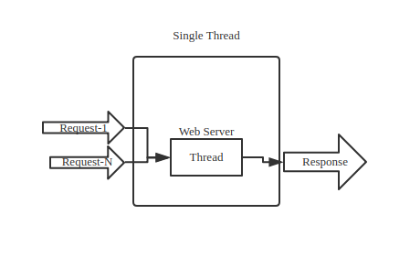
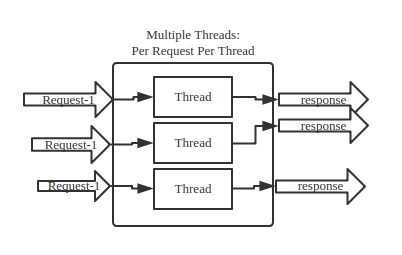

# JAVA Multiple Threads

## Why Multiple Threads

- Multiple threads fully leverage CPU Cores
- Quick Response
- Do more thing with Multiple Threads

For example:
If A Web Server Only a single thread application:


It should be slow, every request need to wait for previous request to complete.
But if multiple threads, it should be much faster, because several threads process requests
at same time:




## Basic Usage in JAVA

- ```Runnable```

```java 
public class RunnableSample implements Runnable {

  public void run() {
    System.out.println("Runnable Sample!");
  }

  public static void main(String[] args) {
    new Thread(new RunnableSample()).start();
  }
}
```

- ```Thread```

```java 
public class ThreadExtendedSample extends Thread {

  @Override
  public void run() {
    System.out.println("this thread extended sample");
  }

  public static void main(String[] args) {
    new ThreadExtendedSample().start();
  }
}
```

For Runnable and Thread, just think it in this way:

```A Runnable Object Running in A Thread Object.```

- Multiple Threads:

```java 
public class MultipleThreadsDemo {
    static Random random = new Random();

    public static void main(String[] args) {
        for (int i = 0; i < 100; i++) {
            new Thread(new Runnable() {
                public void run() {
                    try {
                        Thread.sleep(random.nextInt(300));
                    } catch (InterruptedException e) {
                        e.printStackTrace();
                    }
                    System.out.println("Current Thread is "+Thread.currentThread().getName());
                }
            }).start();
        }
    };
}
```

result:

```
Current Thread is Thread-0
Current Thread is Thread-24
Current Thread is Thread-9
Current Thread is Thread-51
Current Thread is Thread-29
Current Thread is Thread-20
Current Thread is Thread-48
Current Thread is Thread-19
Current Thread is Thread-38
Current Thread is Thread-73
Current Thread is Thread-52
Current Thread is Thread-87
Current Thread is Thread-26
Current Thread is Thread-2
```

From this example, the different threads are actually doing their own job despite 
what other thread is doing, and it is not sequence, it is obviously quicker than single thread
application, there is no waiting queue in this case, everyone start a thread to do its job.

That's it for basic multiple threads ideas. Let's move to next chapter, thead state.